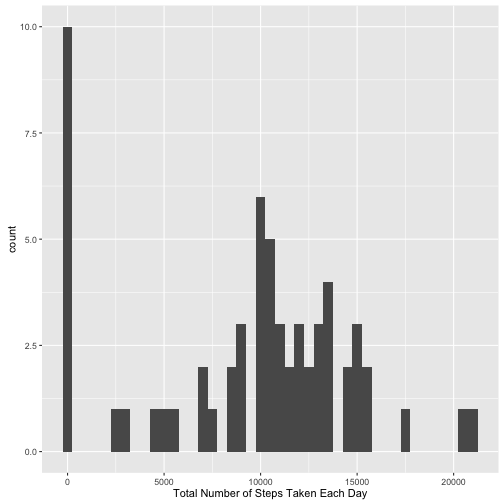

Reproducible Research Course Project 1
=======================================

## *Q1: Loading and preprocessing the data*
### 1. Code for reading in the dataset and/or processing the data:


```r
setwd("/Users/YanYang/code/RR_week2")
data <- read.csv("/Users/YanYang/code/RR_week2/activity.csv")
library(ggplot2)
```

## *Q2: What is mean total number of steps taken per day?*
### 1. Histogram of the total number of steps taken each day


```r
dailySum <- tapply(data$steps, data$date, sum, na.rm = TRUE)
qplot(dailySum, binwidth = 500, xlab = "Total Number of Steps Taken Each Day")
```



### 2. Mean and median number of steps taken each day

```r
mean <- mean(dailySum)
median  <- median(dailySum)
cbind(mean, median)
```

```
##         mean median
## [1,] 9354.23  10395
```

## *Q3: What is the average daily activity pattern?*
### 1. Time series plot of the average number of steps taken

```r
timeMean <- as.numeric(tapply(data$steps, data$interval, mean, na.rm = TRUE))
plot2 <- data.frame(unique(data$interval), timeMean)
colnames(plot2) <- c("interval", "mean")
g2 <- ggplot(plot2, aes(x = plot2$interval, y = plot2$mean))
g2 + geom_line() + labs(x = "Time Intervals", y = "Average Number of Steps Taken")
```


### 2. The 5-minute interval that, on average, contains the maximum number of steps

```r
max <- subset(plot2, plot2[, 2] == max(plot2[, 2]))
print(paste("The inverval contains the maximum number of steps is interval", max[ ,1], "."))
```

```
## [1] "The inverval contains the maximum number of steps is interval 835 ."
```

## *Q4: Imputing missing values*
### 1. Code to describe and show a strategy for imputing missing data

```r
#calculate the total number of missing values
numNa <- sum(is.na(data$step))
print(paste("The total number of missing value is", numNa, "."))
```

```
## [1] "The total number of missing value is 2304 ."
```

```r
#impute the missing values
dataOriginal <- data
for (i in 1:nrow(data)){
        if(is.na(data[i, 1]) == TRUE){
                data[i, 1] <- plot2[plot2$interval == data[i, 3], 2]
        }else{
                next
        }
}
```

### 2. Histogram of the total number of steps taken each day after missing values are imputed

```r
dailySum2 <- tapply(data$steps, data$date, sum)
qplot(dailySum2, binwidth = 500, xlab = "Total Number of Steps Taken Each Day after Missing Values Are Imputed")
```


```r
#comparing the mean and median before and after the imputing
mean2 <- mean(dailySum2)
median2 <- median(dailySum2)
mat <- matrix(c(mean, mean2, median, median2), nrow = 2, ncol = 2)
table <- as.data.frame(mat, row.names = c("Origianl", "Imputed"))
colnames(table) <- c("Mean", "Median")
table
```

```
##              Mean   Median
## Origianl  9354.23 10395.00
## Imputed  10766.19 10766.19
```

## *Q5: Are there differences in activity patterns between weekdays and weekends?*
### 1. Panel plot comparing the average number of steps taken per 5-minute interval across weekdays and weekends

```r
#create a dataset with a forth variable indicating whether a given date is a weekday or weekend day.
data$type <- weekdays(as.Date(data$date))
for (i in 1:nrow(data)){
        if (data[i, 4] %in% c("Monday", "Tuesday","Wednesday", "Thursday", "Friday")){
                data[i, 4] <- "Weekday"
        }else{
                data[i, 4] <- "Weekend"
        }
}
#make a required plot
weekdays <- subset(data, data$type == "Weekday")
wdTime <- tapply(weekdays$steps, weekdays$interval, mean)
wddf <- data.frame(unique(weekdays$interval), wdTime, rep("Weekday", times = length(wdTime)))
colnames(wddf) <- c("interval", "step", "type")
weekends <- subset(data, data$type == "Weekend")
weTime <- tapply(weekends$steps, weekends$interval, mean)
wedf <- data.frame(unique(weekends$interval), weTime, rep("Weekend", times = length(weTime)))
colnames(wedf) <- c("interval", "step", "type")
plot4 <- rbind(wddf, wedf)
g4 <- ggplot(plot4, aes(x = interval, y = step))
g4 + geom_line() + facet_grid(type ~.) + labs(x = "Interval", y = "Number of Steps")
```


